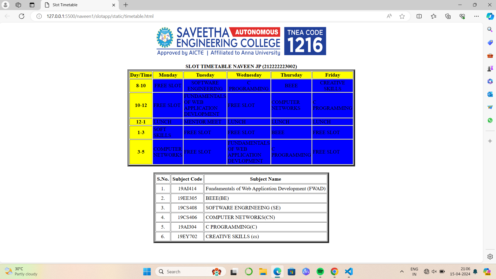

# Ex03 Time Table
## Date:15.04.2024

## AIM
To write a html webpage page to display your slot timetable.

## ALGORITHM
### STEP 1
Create a Django-admin Interface.

### STEP 2
Create a static folder and inert HTML code.

### STEP 3
Create a simple table using ```<table>``` tag in html.

### STEP 4
Add header row using ```<th>``` tag.

### STEP 5
Add your timetable using ```<td>``` tag.

### STEP 6
Execute the program using runserver command.

## PROGRAM
```py
<html>
    <head>
        <title>Slot Timetable</title>
    </head>
    <body>
        <center>
            
        </center>
        <br>
        <table align="center" width="540">
            <caption><b>SLOT TIMETABLE  NAVEEN JP (212222223002)</b></caption>
            <tr align="center">
                <th bgcolor="yellow">Day/Time</th>
                <th bgcolor="yellow">Monday</th>
                <th bgcolor="yellow">Tuesday</th>
                <th bgcolor="yellow">Wednesday</th>
                <th bgcolor="yellow">Thursday</th>
                <th bgcolor="yellow">Friday</th>
            </tr>
            <tr align="center">
                <th bgcolor="yellow">8-10</th>
                <td bgcolor="blue">FREE SLOT</td>
                <td bgcolor="blue">SOFTWARE ENGINEERING</td>
                <td bgcolor="blue">C PROGRAMMING</td>
                <td bgcolor="blue">BEEE</td>
                <td bgcolor="blue">CREATIVE SKILLS </td>
            </tr>
            <tr align="centre">
                <th bgcolor="yellow">10-12</th>
                <td bgcolor="blue">FREE SLOT</td>
                <td bgcolor="blue">FUNDAMENTALS OF WEB APPLICATION DEVLOPMENT</td>
                <td bgcolor="blue">FREE SLOT</td>
                <td bgcolor="blue">COMPUTER NETWORKS</td>
                <td bgcolor="blue">C PROGRAMMING</td>
            </tr>
            <tr align="centre">
                <th bgcolor="yellow">12-1</th>
                <td bgcolor="blue">LUNCH</td>
                <td bgcolor="blue">MENTOR MEET</td>
                <td bgcolor="blue">LUNCH</td>
                <td bgcolor="blue">LUNCH</td>
                <td bgcolor="blue">LUNCH</td>
            </tr>
            <tr align="centre">
                <th bgcolor="yellow">1-3</th>
                <td bgcolor="blue">SOFT SKILLS</td>
                <td bgcolor="blue">FREE SLOT</td>
                <td bgcolor="blue">FREE SLOT</td>
                <td bgcolor="blue">BEEE</td>
                <td bgcolor="blue">FREE SLOT</td>
            </tr>
            <tr align="centre">
                <th bgcolor="yellow">3-5</th>
                <td bgcolor="blue">COMPUTER NETWORKS</td>
                <td bgcolor="blue">FREE SLOT</td>
                <td bgcolor="blue">FUNDAMENTALS OF WEB APPLICATION DEVLOPMENT</td>
                <td bgcolor="blue">C PROGRAMMING</td>
                <td bgcolor="blue">FREE SLOT</td>
            </tr>
        </table>
        <br>
        <table align="center" cellspacing="2" cellpadding="4" border="2">
            <tr align="center">
                <th>S.No.</th>
                <th>Subject Code</th>
                <th>Subject Name</th>
            </tr> 
            <tr>
                <td align="center">1.</td>
                <td align="center">19AI414</td>
                <td>Fundamentals of Web Application Development (FWAD)</td>
            </tr>
            <tr>
                <td align="center">2.</td>
                <td align="center">19EE305</td>
                <td>BEEE(BE)</td>
            </tr>
            <tr>
                <td align="center">3.</td>
                <td align="center">19CS408</td>
                <td>SOFTWARE ENGRINEEING (SE)</td>
            </tr>
            <tr>
                <td align="center">4.</td>
                <td align="center">19CS406</td>
                <td>COMPUTER NETWORKS(CN)</td>
            </tr>
            <tr>
                <td align="center">5.</td>
                <td align="center">19AI304</td>
                <td>C PROGRAMMING(C)</td>
            </tr>
            <tr>
                <td align="center">6.</td>
                <td align="center">19EY702</td>
                <td>CREATIVE SKILLS (cs)</td>
            </tr>
        </table>
    </body>
</html>

```


## OUTPUT
 
 


## RESULT
The program for creating slot timetable using basic HTML tags is executed successfully.
